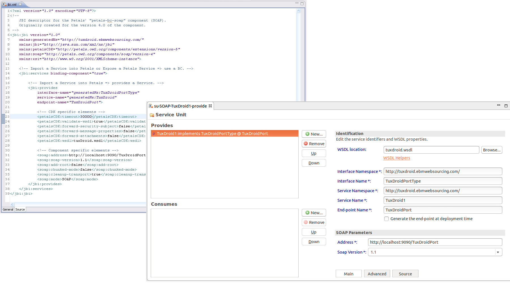

# Petals Studio

Petals Studio is an Eclipse distribution dedicated to Petals ESB.

Some of these tools come from the Eclipse Foundation, while some others were developed specifically for Petals ESB.
Petals Studio aims at providing all the required and available tools for Petals ESB.

The plug-ins that have been developed specifically for Petals Studio are licensed under the terms of the Eclipse Public License.
The Petals Studio itself is a Software distribution where each component is governed by the terms and conditions of its own license.
All the embedded components are open-source.

The complete documentation is available [here](https://doc.petalslink.com/display/petalsstudio/Petals+Studio).

## Screen captures

Petals Studio includes creation and export wizards...

 &nbsp; 

  &nbsp; 

... as well as specialized editors.

## Development Tips

If you have m2e (Eclipse tooling for Maven), you may get errors related
to lifecycle mapping. Just install the [Tycho connectors for m2e](http://repo1.maven.org/maven2/.m2e/connectors/m2eclipse-tycho/0.8.0/N/LATEST/)
in your Eclipse. That should solve these errors.
